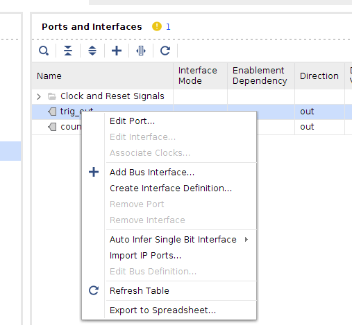
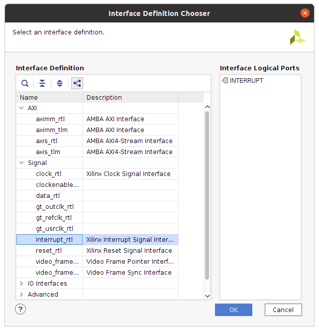
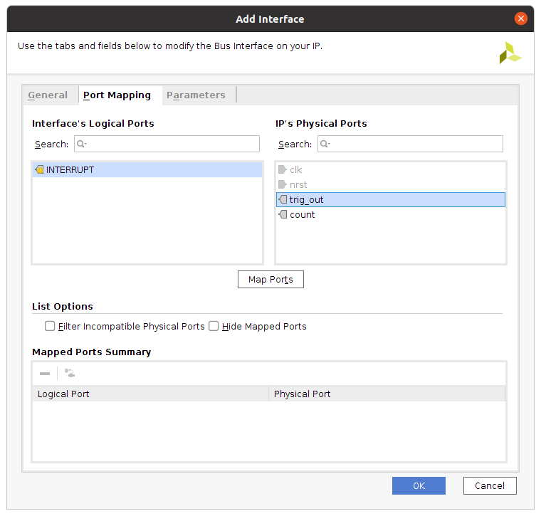

This is an example of a Zynq PL block generating a rising edge triggered interrupt request to the Zynq PS.

# Hardware system

The system consists of the Zynq PS connected to a PL block that generates the required interrupt request. In our case, this is just a timer (`pltimer`) that asserts the IRQ every second. The timer is implemented in Verilog and assumes a system clock of 100 MHz, as this was tested in a Zedboard.

The Verilog code for `pltimer` is [here](pltimer.v). It is important to wrap this block in an IP block (instead of just adding the RTL directly in the block design) as this is the only way to tag the IRQ output as an interrupt line. Failure to do so may result in the software chain tools (SDK/Vitis) being unable to generate the appropriate constants that are associated with your custom IRQ lines.

## Tagging IP pins as interrupts

To tag the output pin of an IP block as an IRQ, go to the **Ports and Interfaces** section of the IP packager and right-click to bring out a pull-down menu. Select the **Add Bus Interface** to bring out the options for assigning an inteface to an IP pin.

Add a new interface and select the **interrupt_rtl** option from the Interface Definition Chooser.

Map the interface's port to the IP block port in the Port Mapping options. In our case, the `trig_out` port will generate the IRQ.

We also need to change the **SENSITIVITY** parameter to `EDGE_RISING` since our timer generates a pulse IRQ (No need to change this if your IRQ is level triggered and active high).

# Software side

Exporting the hardware design to Vitis/SDK should generate the necessary board support package files. Appropriate constants for the interrupt line should be automatically generated in the **xparameters.h** file. The address of the fabric interrupts would follow the naming convention **XPAR_FABRIC_[Instance Name]**. In our example, the constant is `XPAR_FABRIC_PLTIMER_0_TRIG_OUT_INTR`.

Sample code for interrupt handling is included in the [hello_world.c](hello_world.c) file. The original code was obtained from this [tutorial](http://www.globaltek.kr/zynq-interrupt-example-tutorial/). The code was modified to support the edge-triggered IRQ in our example.