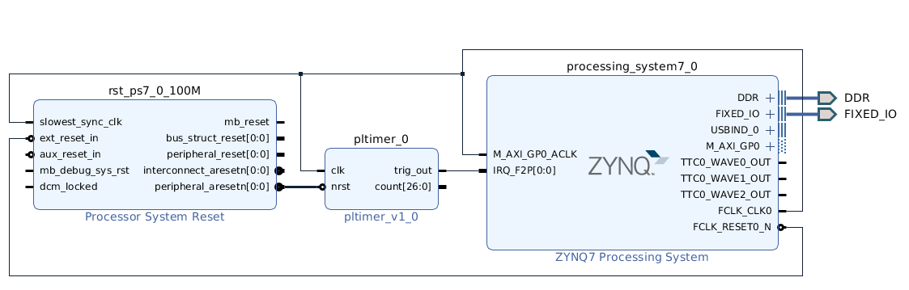

This is an example of a Zynq PL block generating a rising edge triggered interrupt request to the Zynq PS.

# Hardware system

The system consists of the Zynq PS connected to a PL block that generates the required interrupt request. In our case, this is just a timer (`pltimer) that asserts the IRQ every second. The timer is implemented in Verilog and assumes a system clock of 100 MHz, as this was tested in a Zedboard.

The Verilog code for `pltimer is [here](pltimer.v). It is important to wrap this block in an IP block (instead of just adding the RTL directly in the block design) as this is the only way to tag the IRQ output as an interrupt line.